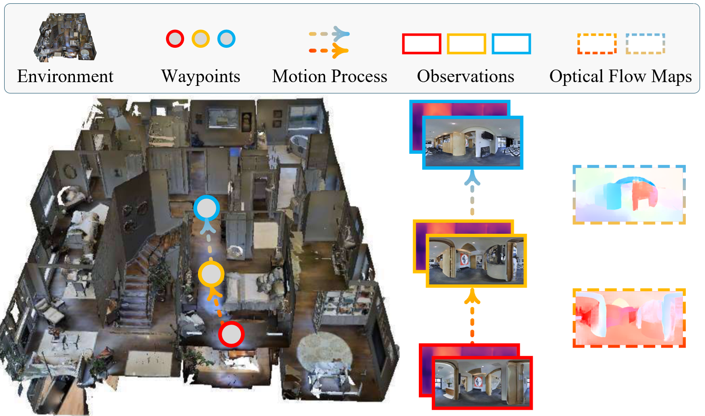
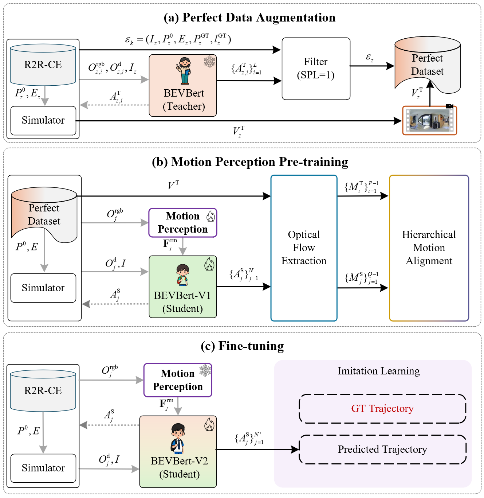

# Motion-VLN: Learning Ego-motion from Optical Flow for VLN-CE

<!-- You can add badges here later, e.g., for License, PyTorch version, or Arxiv link -->
[](https://github.com/Tong-Gao-dream/Motion-VLN)
[]()

> **Abstract:** Vision-and-Language Navigation in Continuous Environments (VLN-CE) requires agents to interpret linguistic instructions and execute precise low-level actions. However, existing methods mainly rely on visual observation, treating the navigation process as executing a sequence of waypoints, while ignoring the ego-motion required to move between adjacent waypoints. To address this deficiency, we propose **Motion-VLN**, a novel framework comprising three stages that introduces optical flow to describe the agent’s ego-motion. The first stage, **Perfect Data Augmentation**, filters high-quality episodes and renders videos of the agent's navigation. In the second stage, **Motion Perception Pre-training**, we use optical flow to help the student model perceive its ego-motion and align it with a teacher model using a hierarchical similarity metric. Finally, the **Fine-tuning** stage optimizes the model on the full dataset. Experimental results on the R2R-CE benchmark demonstrate that Motion-VLN significantly outperforms state-of-the-art methods.

## 📢 News
*   **[2026-01-08]** 🚀 The official repository is created. **Code and pre-trained models will be released very soon!** Please star ⭐ the repo to stay updated.
*   **[Date]** Paper "Motion-VLN: Learning Ego-motion from Optical Flow for VLN-CE" is released.

## ⚡ Introduction

Existing VLN-CE methods often face a "stop-and-go" limitation, treating navigation as isolated snapshots and failing to capture the **ego-motion** process. 

**Motion-VLN** bridges the gap between observation and navigation by explicitly learning motion from **Optical Flow**.

<div align="center">
  <!-- Place Figure 1 from the paper here -->
  
  <br>
  <em>Difference between discrete waypoint observations (RGB-D) and Optical Flow motion maps.</em>
</div>

### Key Contributions:
1.  **Explicit Motion Modeling:** We are the first to introduce optical flow into the VLN-CE domain to bridge the gap between observation and navigation.
2.  **Perfect Data Augmentation:** A strategy to generate a "Perfect Dataset" providing high-quality, consistent motion labels (SPL=1) and rendered navigation videos.
3.  **Hierarchical Motion Alignment:** A pre-training objective that aligns the student's motion with the teacher's at both local pixel-wise levels (Euclidean, Cosine, Gradient) and global distribution levels.
4.  **SOTA Performance:** We achieve state-of-the-art results on the R2R-CE benchmark.

## 🛠️ Method Overview

Our framework consists of three progressive stages:

1.  **Perfect Data Augmentation:** Generating high-quality trajectory videos using a teacher model (BEVBert).
2.  **Motion Perception Pre-training:** Training the student model to imitate the teacher's motion using Optical Flow supervision and a **Hierarchical Motion Alignment** module.
3.  **Fine-tuning:** End-to-end training on the full R2R-CE dataset via Imitation Learning.

<div align="center">
  <!-- Place Figure 2 from the paper here -->
  
  <br>
  <em>Overall pipeline of the Motion-VLN framework.</em>
</div>

## 📊 Results

Motion-VLN achieves superior performance on the R2R-CE dataset, particularly in **Success Rate (SR)** and **Success weighted by Path Length (SPL)**.

| Method | Val-Unseen SR↑ | Val-Unseen SPL↑ | Test Unseen SR↑ | Test Unseen SPL↑ |
| :--- | :---: | :---: | :---: | :---: |
| HPN+DN | 36 | 34 | 32 | 30 |
| Sim2Sim | 43 | 36 | 44 | 37 |
| ETPNav | 57 | 49 | 55 | 48 |
| BEVBert | 59 | 50 | 59 | 50 |
| HNR | 61 | 51 | 58 | 50 |
| **Motion-VLN (Ours)** | **63** | **56** | **61** | **53** |

## 📂 Dataset Preparation

*(Instructions for downloading R2R-CE data and the generated 'Perfect Dataset' will be provided here upon release.)*

## 🚀 Usage

*(Detailed training and evaluation scripts will be updated here.)*

```bash
# Example placeholder command
# python run.py --mode train --config configs/motion_vln.yaml
